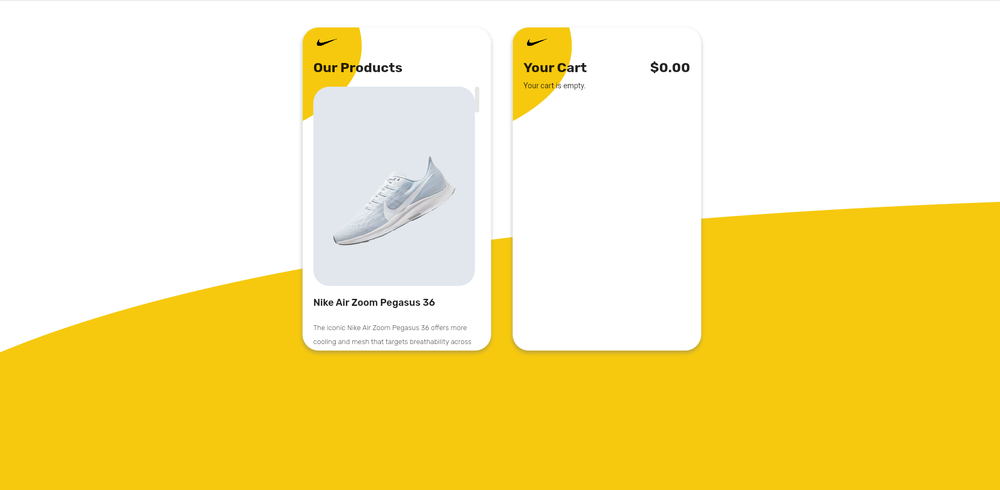

# shoes_shop

Dưới đây là kết quả của tôi:

- [Live Demo](https://shoe-shops.vercel.app/#/)

## Getting Started

Những mục đã hoàn thành:

### Must have:

- Hiển thị tất cả sản phẩm trong Our Products. Khi lần đầu vào app, dữ liệu sẽ được lấy từ server về nên bị chậm. Nếu gặp trường hợp không hiển thị tất cả sản phẩm, hãy reload lại trang.

    - Sản phẩm có tên, mô tả, giá, hình ảnh và nút **Add To Cart**. 
    - Người dùng có thể nhấp vào **Add To Cart** để thêm sản phẩm vào giỏ hàng của họ
    - Sản phẩm đã thêm không có nút **Add To Cart** nữa, thay vào đó, nó hiển thị **Check Mark Icon (✓)**.
  
- Hiển thị tất cả các sản phẩm đã thêm trong phần Your Cart:
    - Mỗi sản phẩm trong giỏ hàng có tên, giá, hình ảnh, nút tăng/giảm số lượng và nút xóa.
    - Người dùng có thể tăng/giảm số lượng sản phẩm trong giỏ hàng. Khi số lượng sản phẩm giảm xuống 0, sản phẩm đó sẽ bị xóa khỏi giỏ hàng.
    - Người dùng có thể xóa sản phẩm khỏi giỏ hàng.
    - Hiển thị tổng giá của tất cả các sản phẩm trong xe. Khi người dùng tăng/giảm số lượng sản phẩm hoặc xóa sản phẩm, tổng giá sẽ được tính lại chính xác.
    - Khi không có sản phẩm trong giỏ hàng, chúng ta nên hiển thị thông báo **Your cart is empty**.
    - Khi người dùng truy cập ứng dụng, các sản phẩm được thêm trước sẽ được hiển thị, người dùng không cần thêm lại sản phẩm.

### Nice to have:

- Thiết kế trên giao diện mobile, destop và web
- Triển khai ứng dụng trên Vercel
  
### Can not do it:

- Khi người dùng xóa sản phẩm khỏi **Cart**. Nút **Check Mark Icon (✓)** không trở lại nút **Add To Cart** mà phải reload lại app mới hiển thị.
- Animation cho việc thêm và xóa sản phẩm

